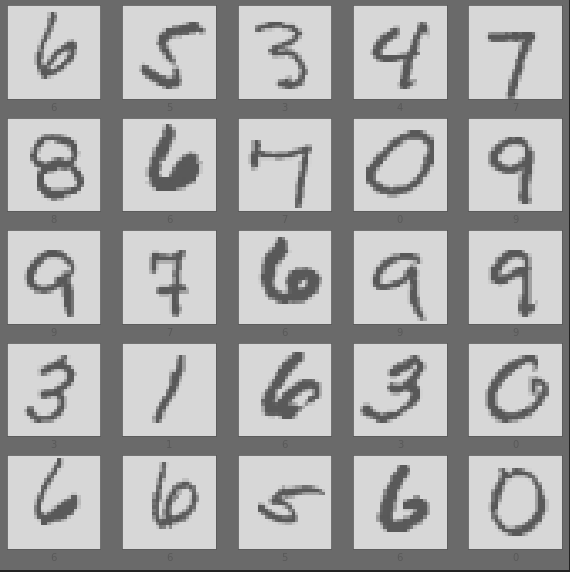
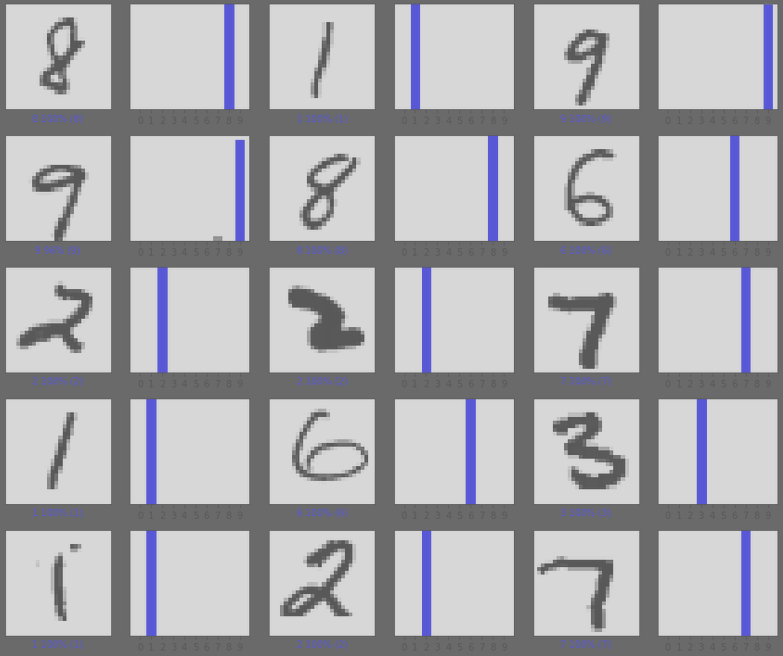
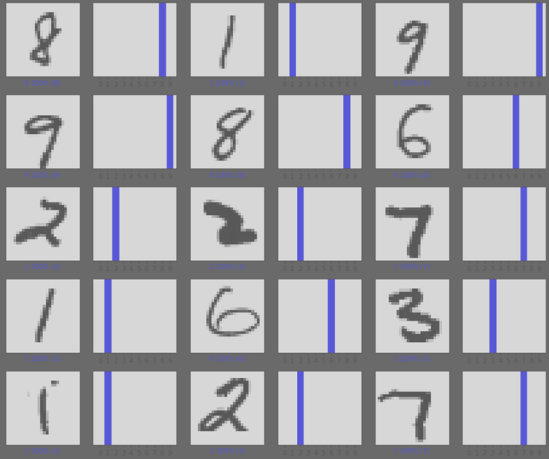

### CNNvsNN_Digit_recognizer
This project was conducted to compare the difference in performance of Convolutional neural network (CNN) and regular Neural network (NN) on a common dataset.

# Dataset
A commonly used beginner dataset from Kaggle was used for this project, feel free to visit the project via:

https://www.kaggle.com/c/digit-recognizer

## Problem
A commonly used technique to analyze images with deep-learning is to use convolutional neural networks however for larger datasets it can take a tremendous amount of time due to CNN:s being quite taxing on hardware. Would it make sence in a first analysis stage to instead use a simpler neural network?

## Data
The data consists of 42 000 images, each with the dimensions of 28x28 pixles. Here is how the digets look like:

The data is clean and evenly distributed, let's train!

## Dense Neural Network
The results from a dense neural network performed better than expected with an accuracy of slighly above 99%. 

It took the Dense neural network 13 seconds to reach 99.4% accuracy.

## Convolutional Neural Networks
The final results from the CNN performed even better, probably better than me, after some manual labour I disagreed with some of the target lables but I digress.

It took the CNN roughly 35 secons to reach an accuracy of 99.3%, after that it steadely increased its accuracy and peaked at 99.9% accuracy with questionable validation loss. Though it took about 2 minutes.

## In Conclusion
According to these tests a reasonable conclusion would be that a NN can perform quite well in comparison with a CNN in a image classification task. 
Another test is in process with a more complex image classification problem to further prove or disprove this hypothesis, that a NN instead of a CNN can ease the load on calculation servers and reduce the calculation time for a "first analysis" scenario.
